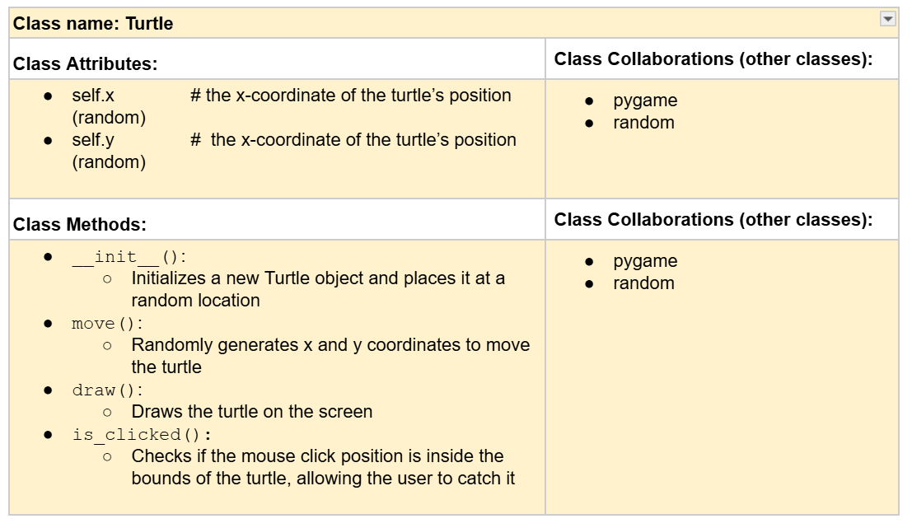

# CSC226 Final Project

## Instructions

❗️Exclamation Marks ❗️indicate action items; you should remove these emoji as you complete/update the items which 
  they accompany. (This means that your final README should have no ❗️in it!)

**Author(s)**: Kushal Phuyel and Naz Tulegenova

**Google Doc Link**: https://docs.google.com/document/d/1uXYmq2smmy8lrSaCPWos-9aN8YhU7vEmuUgoHlaSnnY/edit?usp=sharing

---

## Milestone 1: Setup, Planning, Design

**Title**: `TurtlEvasion!`

**Purpose**: `This project is a clicking game where players tap a randomly appearing turtle to earn points within a 
20-second timer.`

**Source Assignment(s)**: `T02: Exploring Turtles, T03: Boustrophedon Turtles, HW06: Oh The Places You'll Go, 
HW02: Loopy Turtles and HW 03: Fully Functional Gitty Psychedelic Robotic Turtles. We are planning to use as many 
things we need in order to complete this project. We have a lot of source assignments listed but we will use 
certain things from each one because each assignment has new things about turtle. `

**CRC Card(s)**:
  - Create a CRC card for each class that your project will implement.
  - See this link for a sample CRC card and a template to use for your own cards (you will have to make a copy to edit):
    [CRC Card Example](https://docs.google.com/document/d/1JE_3Qmytk_JGztRqkPXWACJwciPH61VCx3idIlBCVFY/edit?usp=sharing)
  - Tables in markdown are not easy, so we suggest saving your CRC card as an image and including the image(s) in the 
    README. You can do this by saving an image in the repository and linking to it. See the sample CRC card below - 
    and REPLACE it with your own:
  


**Branches**: This project will **require** effective use of git. 

Each partner should create a branch at the beginning of the project, and stay on this branch (or branches of their 
branch) as they work. When you need to bring each others branches together, do so by merging each other's branches 
into your own, following the process we've discussed in previous assignments, then re-branching out from the merged code.  

```
    Branch 1 starting name: kushals branch - phuyelk
    Branch 2 starting name: naz's branch - tulegenovan
```

### References 

Throughout this project, you will likely use outside resources. Reference all ideas which are not your own, 
and describe how you integrated the ideas or code into your program. This includes online sources, people who have 
helped you, AI tools you've used, and any other resources that are not solely your own contribution. Update this 
section as you go. DO NOT forget about it!

```
    we used ChatGPT when we got absolutely stuck, and needed some guidance. We used it to help us guide us in the right 
    directions when we got stuck. We also used the PyCharm game dictionary along with the Tkinter, we also had to track back
    to some of the HW and TW to get ideas on how to use randit, and things of that sort. 
```

## Milestone 2: Code Setup and Issue Queue

Most importantly, keep your issue queue up to date, and focus on your code. 🙃

Reflect on what you’ve done so far. How’s it going? Are you feeling behind/ahead? What are you worried about? 
What has surprised you so far? Describe your general feelings. Be honest with yourself; this section is for you, not me.

```
    We are feeling good about our project, we made a lot of progress and I feel that we are ahead of others. 
    Only thing that has us worried is how we will implement the different difficulty levels into the game. But overall,
    we are doing well and cooperating well and also putting in equal amount of efforts and work. 
```

---

## Milestone 3: Virtual Check-In

Indicate what percentage of the project you have left to complete and how confident you feel. 

**Completion Percentage**: `85%`

**Confidence**: Describe how confident you feel about completing this project, and why. Then, describe some 
  strategies you can employ to increase the likelihood that you'll be successful in completing this project 
  before the deadline.

```
    very confident, we are almost done, and we have been progressing greatly. Something we can keep doing to ensure
    we get this done is keep working on it together, and make progress everytime we do. 
```

---

## Milestone 4: Final Code, Presentation, Demo

### User Instructions

After you press the Run button in PyCharm, the game window will appear. 
Click on the turtle as fast as you can every time it randomly shows up on 
the screen. Every click on the turtle gives you 1 point, if you end up clicking
on the fake turtle, which is the green fish, you will then lost a point. The game will 
automatically end after 20 seconds. Once the game ends, your final score 
will be displayed, and asked if you want to play again or not. if user presses no
then the game window will close and stop running, if user presses yes then game and window
will restart in order to start another round. 

### Errors and Constraints

I believe that our code runs well, and just the way we want it to. 

### Peer Evaluation

Both partners contributed equally to the project. We communicated effectively, divided 
tasks fairly, and helped each other debug and test the program. Both of us committed 
regularly to the GitHub repository and worked together in meetings to solve problems. 
We feel both partners should receive full credit for the work.

### Reflection

Each partner should write three to four well-written paragraphs address the following (at a minimum):
- Why did you select the project that you did?
- How closely did your final project reflect your initial design?
- What did you learn from this process?
- What was the hardest part of the final project?
- What would you do differently next time, knowing what you know now?
- How well did you work with your partner? What made it go well? What made it challenging?

```
    Partner 1: We chose this project because we wanted to challenge ourselves by making a 
    fun game that uses what we’ve learned in class, especially working with images, mouse events, 
    and random movement. I really like how we turned an idea into an actual working game. I think 
    our final project reflects our original design pretty well, except we didn’t get to fully 
    finish adding difficulty levels. From this process, I learned a lot about how to break a big 
    problem into smaller pieces, and how useful Git is for teamwork. The hardest part was fixing 
    small bugs that didn’t always show up consistently, like the turtle sometimes disappearing or 
    overlapping screen edges. If I could do it again, I would start testing more complex features 
    earlier instead of waiting toward the end. I think I worked well with my partner because we 
    kept communicating openly, shared tasks, and always tried to help each other when one of us got stuck.
```

```
    Partner 2: We picked this project because we thought it would be fun and we could apply lots of the 
    turtle and graphics techniques we practiced in earlier assignments. I think the final project 
    matches our original idea in most ways. We successfully made a working game with a timer and score
    tracking. I learned a lot about working with images, classes, and event handling in Python. The hardest part for 
    me was getting the timer and movement to work together without freezing or glitching. If I could change something,
    I would want to start integrating features like the difficulty earlier so we had more time to debug them. I really liked 
    working with my partner; we both stayed motivated and worked hard, and we managed to divide the work 
    fairly while helping each other at the same time.
```

---